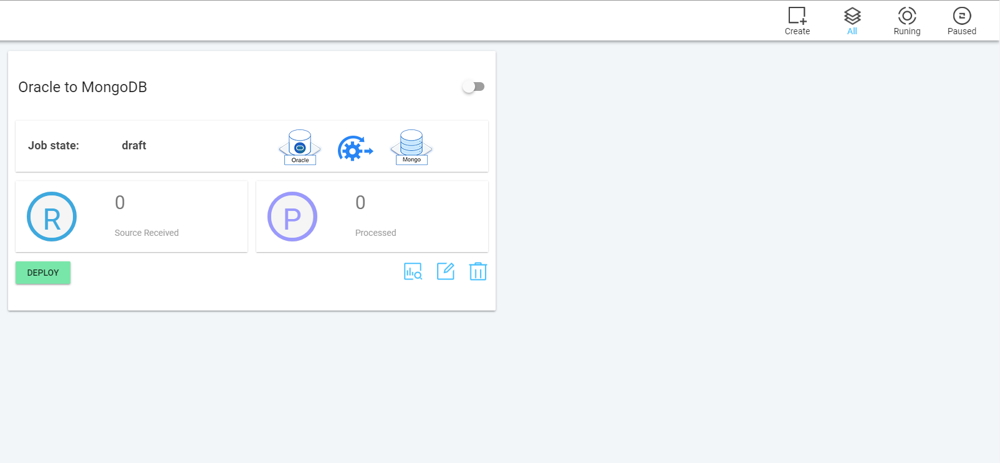
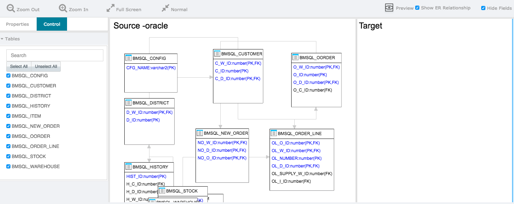
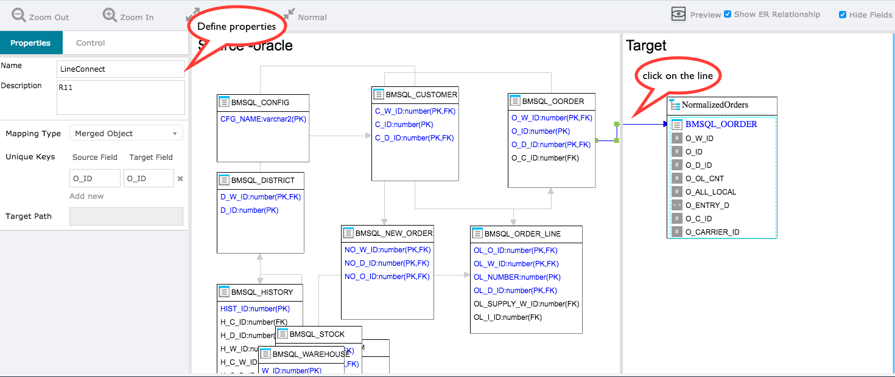
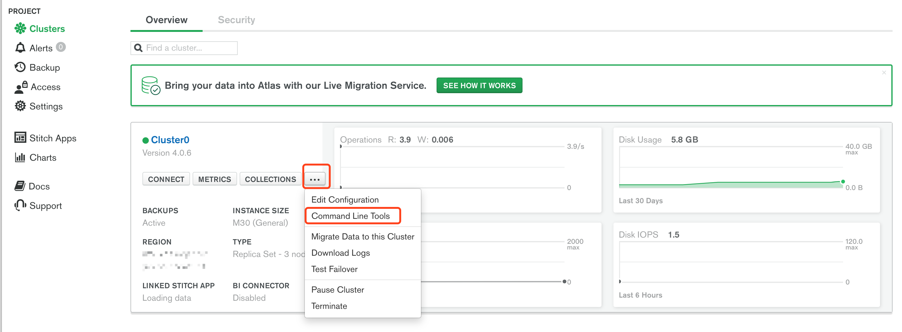

# 任务配置

## 1. 采集关系型数据库数据到 MongoDB

这里我们用 Oracle 作为示例演示。

### 1.1 任务列表

“任务列表”页面如下图所示。它列出了您定义的所有复制作业。您可以使用此视图查看，编辑，运行和删除作业，或创建新作业。



默认情况下，它显示所有作业，包括运行的作业和已停止的作业。

要仅查看正在运行的作业，请单击工具栏中的“正在运行”。

要仅查看已停止的作业，请单击工具栏中的“已暂停”。

### 1.2 创建作业页面

单击右上角的“创建”以创建新的复制作业。在作页面上，系统会要求您填写以下作业详细信息：

- 输入作业名称
- 选择同步模式
- 选择源连接
- 定义模型映射(可选)
- 选择目标连接

#### 1.2.1 作业名称

输入作业描述

#### 1.2.2 选择同步模式

选择要将表复制到NoSQL数据库的方式。目前支持两种选择：

- 克隆数据库

如果要将关系数据库按原样克隆到MongoDB，请选择此模式。例如，如果Oracle数据库中有10个表，那么在复制之后，MongoDB中将有10个完全相同的数据结构的集合。

- 自定义同步

如果要执行模型转换，请选择此选项，例如将多个表中的数据合并到一个JSON集合中。

#### 1.2.3 选择源连接

选择源连接作为复制源。您可以在[连接配置](connection-config-cn.md)页面上创建或管理连接。

#### 1.2.4 编辑映射

单击映射时，下面会出现一个映射编辑器窗口。映射窗口用于在视觉上帮助您创建JSON转换的关系表。有关映射的更多详细信息，请参见下面的“编辑映射”部分


#### 1.2.5 选择目标连接

选择目标连接作为复制目标。您可以在[连接配置](connection-config-cn.md)页面上创建或管理连接。


### 1.3 Mapping 设计器

映射编辑器水平分为3个窗格：属性窗格，源窗格和目标窗格。

初始化编辑器时，它将自动从关系数据库加载模式，并在“源”窗格中绘制ER图。当数据库中有许多表时，只显示前20个表。您可以使用“属性”窗格中的“表过滤器”来选择要在ER图窗格中显示的表。



#### 1.3.1 放大/缩小

使用此选项可放大/缩小映射窗口

#### 1.3.2 全屏

单击此按钮进入全屏模式

#### 1.3.3 正常

单击此按钮返回正常模式

#### 1.3.4 预览

在目标数据库中预览JSON数据结构

#### 1.3.5 显示 ER 关系

是否在ER digram区域显示关系线。

#### 1.3.6 隐藏字段

隐藏表列 - 当表包含太多列以使屏幕变得拥挤时，这很有用。

### 1.4 定义映射规则

要定义要收集的表(Relational to JSON)映射，请按照下列步骤操作：

- 拖动要从中复制数据的表
- 移动到目标窗格中的空白区域。
- 释放鼠标。
- 将自动创建具有相同名称的集合。
- 也会自动创建映射线，将源窗格中的表连接到目标窗格中的新集合。
- 单击该行以自定义映射规则属性。



#### 1.4.1 如何定义规则属性

##### 1.4.1.1 名称

这是规则的描述性名称

##### 1.4.1.2 映射类型

在这里，您可以选择以下三个值之一：Merged Object，Sub document和Array。

- 合并对象

用于简单的一对一映射。该集合将镜像表结构。

- 子文件

表数据将作为子文档嵌入到JSON中

- 数组

表数据将作为子数组嵌入JSON中。表中的每一行都将成为嵌入数组中的一个元素。

数组可用于建模1：N关系，例如，订单可能有多个订单行项目。

##### 1.4.1.3 唯一键

指定源表中每行的唯一键。在大多数情况下，这与关系表中的主键列相同。 Tapdata 需要此信息才能在目标集合中查找相应的 JSON 以执行更新操作。

您应该提供唯一键，否则 Tapdata 可能会将所有列用作唯一键。使用所有列都会影响性能。

##### 1.4.1.4 数组匹配键

仅当您选择“数组”作为映射类型时，此选项才适用。当源表发生更改时，Tapdata 需要在目标 JSON 集合中的数组中执行相关更新。数组匹配键将用于标识要更新的相应数组元素。

##### 1.4.1.5 目标路径

您可以选择指定嵌入的字段路径名称。默认情况下，它使用表名

### 1.5 自定义表属性

您可以单击任何表来自定义与此表相关的某些复制属性。


#### 1.5.1 名称

仅供参考。

#### 1.5.2 描述

表格描述，仅供参考。

#### 1.5.3 自定义Sql

使用此文本字段提供自定义sql以从表中加载初始数据。默认情况下，系统将使用以下SQL语句来加载初始数据：

```
SELECT * from TABLE_NAME
```

使用默认SQL时，系统不会跟踪加载进度。当作业停止然后重新启动时，它将从开始重新加载所有初始数据。

如果您想跟踪加载进度并能够在重新启动作业时从停止点恢复，则需要提供带偏移跟踪列的自定义sql。

对于具有“LAST_UPDATED_TIME”列的表，您可以使用此类型的列来实现偏移跟踪目的。例如，您可以提供自定义SQL，如下所示：

```
SELECT * FROM ORDERS WHERE LAST_UPDATED_TIME > TO_DATE('${OFFSET1}');
```

注意使用 **${OFFSET1}** 。这是一个占位符，将被指定的“偏移”值替换(在下面的字段中提供)。目前仅支持1个偏移列。将来可能支持多个偏移列。因此后缀号码。

#### 1.5.4 偏移

使用自定义sql进行偏移跟踪时，必须提供初始偏移值。例如，如果将LAST_UPDATED_TIME用作偏移列，则可以提供此列的字符串值，例如：

```
2018-01-01 12:00:00
```

### 1.6 作业属性

单击屏幕右上角的齿轮图标或单击图表中的任何空白区域时，将打开“作业属性”视图。

#### 1.6.1 同步类型

Initial Sync（初始化同步）：在此模式下，Tapdata 只会从源数据库中读取当前数据。一旦读取所有数据并将其复制到目标系统，作业将停止。

CDC（增量同步）：在此模式下，Tapdata 将不断读取和解析源数据库的事务日志文件，并将每个更改复制到目标系统。作业将继续运行，直到停止。

Initial Sync + CDC（初始化同步 + 增量同步）：在此模式下，Tapdata 将首先执行初始同步。初始同步后，Tapdata 将切换到 CDC 模式以继续将更改的操作从源复制到目标。

#### 1.6.2 同步点

当同步类型是CDC时，您可以指定CDC操作应从哪个点开始读取数据。

起始：事务日志文件的开头。

当前：从作业开始的那一刻起。

同步时间：您可以手动指定开始同步的时间点。

## 2. 二进制文件采集

本页面将引导您顺利配置一个二进制文件的采集任务。

### 2.1 采集二进制文件到 MongoDB的GridFS 中

创建一个任务，将文件从指定目录采集到 mongodb 中。

1. 创建一个源端连接 ”File(s)“，您可以参考 [连接配置](connection-config-cn.md)

2. 创建一个目标端连接 “GridFS”，您可以参考 [连接配置](connection-config-cn.md)

3. 创建一个任务，源端选择第一步创建的连接，目标端选择第二步创建的连接。

**注意：** Files 作为源端的时候是不允许将“同步模式”设置为“Custom”的，只能设置“Database Clone”。

**注意：** 源端 Files 中，您需要明确该连接同步的文件类型包括哪些，比如 Excel、CSV、Json、XML，文件类型的获取可以通过创建 Files 连接时的文件名正则表达式去匹配获取。

在 GridFS 的目标端配置时，同样也需要明确本次创建的GridFS和哪个 Files 组合。

如果 Files 获取的是 Excel 文件，而 GridFS 获取的是 XML 文件，自然不会有数据同步到 MongoDB 中。

至此，文件已顺利同步到 GridFS 中。若您还想进一步将Excel的数据同步到mongodb中，而不仅是文件本身，那么需要继续执行下面步骤

### 2.2 采集文件中的数据到 MongoDB 中

首先需要按照 #2.1 将文件采集到GridFS中，接着在创建一个任务将 GridFS 中文件的具体数据采集到 MongoDB 的集合中。

1. 创建一个源端连接 “GridFS”，您可以参考 “GridFS Configuration”

2. 创建一个目标端连接 “MongoDB”，您可以参考 “MongoDB Configuration”

3. 创建一个任务，源端选择第一步创建的连接，目标端选择第二步创建的连接。

4. 在这个任务中，我们可以自由选择“同步模式”为“Database Clone” 还是 “Custom”。

5. 之后的配置和配置普通任务一样，可以参考 “Manage Jobs”
 
通过 #2.1 和 #2.2 两个 Job 的组合，就可以完成同步文件数据到 MongoDB 的业务场景了。


## 3. 企业上云， Local MongoDB 到 Atlas

本文档提供有关从源 MongoDB 集群迁移到 Atlas 的步骤。

1. 使用 mongodump 导出源 MongoDB 数据。

    ```
    mongodump --host <IP>：<PORT> --username <USERNAME> --password <PASSWORD> --authenticationDatabase admin --db <DATABASE>
    ```

2. 使用 mongorestore 将数据导入到 Atlas。可以在截图中找到此命令。

    ```
    mongorestore --host <ATLAS HOST> --ssl --username <USERNAME> --password <PASSWORD> --authenticationDatabase admin
    ```

    

    由于网络流量将支付大量费用，我们建议您在第一时间使用 mongodump 和 mongorestore 初始化数据库

3. 记下您的目标 MongoDB 最后记录日期时间，稍后将使用它

4. 找到一台以访问 mongo 源集群的 EC2 机器

5. 在 EC2 计算机上安装 jdk8 , [https://gist.github.com/rtfpessoa/17752cbf7156bdf32c59](https://gist.github.com/rtfpessoa/17752cbf7156bdf32c59)。

6. 在 [https://cloud.tapdata.io](https://cloud.tapdata.io) 上注册帐户

7. 下载 Tapdata 代理并复制到 EC2 实例

    1. 按照页面上的说明配置 Tapdata 代理

    2. 启动代理

8. 访问 [https://cloud.tapdata.io/#/agents](https://cloud.tapdata.io/#/agents) 以验证代理是否在线

9. 访问 [https://cloud.tapdata.io/#/connection](https://cloud.tapdata.io/#/connection) 以添加源连接到您的 MongoDB 集群，您必须在连接 URI 中指定数据库

10. 创建目标连接，指定到 Atlas 数据库

11. 访问 [https://cloud.tapdata.io/#/dataCollect](https://cloud.tapdata.io/#/dataCollect) 创建新作业

    1. 同步模式：数据库克隆

    2. 来源：选择上面创建的源连接

    3. 目标：选择上面创建的目标连接

    4. 单击作业设置上的齿轮图标

        1. 选择 CDC，因为您已通过 mongorestore 还原整个数据库，所以可以直接复制增量数据。

        2. 选择“SYNC TIME”，选择"步骤3 datetime"。为确保数据的一致性，您可以提前一天设置日期，Tapdata 支持幂等，这样您就不必担心数据质量问题。

    5. 保存

12. 单击“开始”按钮以部署（运行）作业。